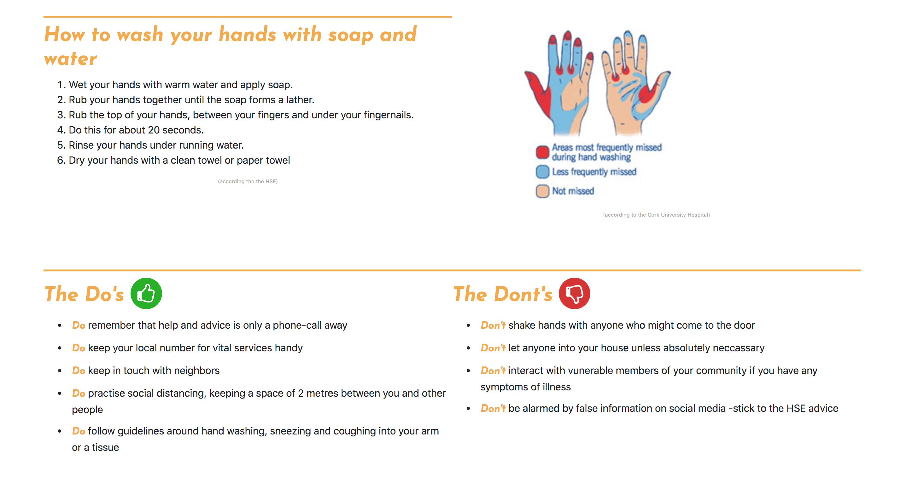
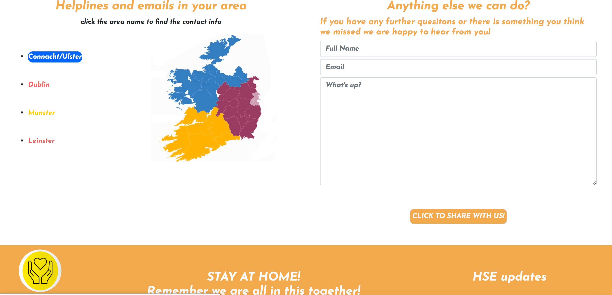
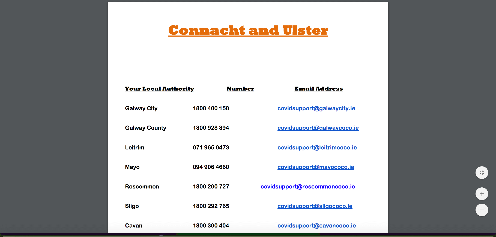

   # Covid-19 Help and Info
  

 This is a Covid-19 help and info website which is designed to present information on covid-19 to anybody concerned about the pandemic or
 looking for general advice on how to take care of themselves and others. A second goal is to provide options on how they can help and even who to contact for more info. 
 The general goal of the website is to increase the safety of the community at large by providing info in a simple and concise way from reputable sources. 

A user would expect to find concise and clear instructions on what to do and what not to do during this pandemic to increase their safety.

A user would want to be able to access helplines and email addresses for their region. part a is the page view on contact info and part b is the new tab which appears when sekected with the info. Example below is Connacht and Ulster.

## a)

## b)

 ## Strategy
The strategy is to help inform the community about the dangers of covid-19, how to take care of themselves as well others and to generally keep people up to date on covid-19. 

## Scope 
Below is a breakdown of each page's features and content and wha thte user can expect to us them for.

The **landing page** allows the user to get to grips with the layout of the website and explains the different pages anf how they can be of use to the user. The idea is that this will help speed up the user experience especially for people who are not so comfortable with tech. Alos basic info on covid will be provided aswell as a snipit of what the world health organsiation is saying, so just a general overview. 

The **advice page** will allow the user to learn proper methods of taking care of themselves including washing hands and what to do and not to do in this pandemic. 

The **support page** provdes two services. The first is the user will be able to learn how to take care of vunerable members of the community. The second will offer the user links to volunteering services and links to charities in need of support during the crisis.

The **contact info** provides links for helpline numbers and emails based on regions in Ireland aswell as the ability to write to the owners fot the website with any inquries or questions they have. 

## Structure
The pages have headers with large navbar text and are hover interactive to make it as clear as possible what your clicking and what pages are available. This is to make it user friendly to members of the community who may not be comfortable on computers as some, as I  feel at risk memebers of the community have a strong corrolation with the less tech savy memebers example the elderly.
 The footer is set up similarily. For this reason aswell clear directions on page such as on support and the banner in advice help users with in your face instructions and advice. 

## Skeleton
The original skelton changed over the coarse of the project. I've attached the original sketches of each of the pages and written what changed about them aswell.

[Home-page](./assets/wireframes/landing-page.pdf) - This was just a drawing of what I wanted the user to see when the enter the website rather then the full content of the home page layout.

[Advice-page](./assets/wireframes/advice-page.pdf) - Some extra features where added to the advice page (washing hand advice) which changed the layout from originally planned.

[Support-page](./assets/wireframes/support-volunteer.pdf) - This page had a complete changeup from the original plan as it had a cluttered layout. 

[contact-info](./assets/wireframes/contact-info-page.pdf) - Slight adjustment from original plan with addition of Irish map image. 

## Surface
Used a calmer set of colours for this page primarily as I felt the topic was stressful enough as is. A lot of white space in order to make it a little clearer for users. 

## features
Collapsable menu on mobile for the navagation bar, just to decluter the view.

Used an in-page nav for support page with two buttons as I needed to change from original plan for the page, as seen in the wireframes. Once put together on the fly it 
appeared less cluttered and was a bit less of an infomration-oveload for the user.

**Future features** we wanted to include: 

   **1)** a chat feature on contact info page to help users get in touch faster and have smooth communication with site owners. 
                                       
   **2)** create a sepeate page with greater details on selected charites but time was too much of a constraint.

## Technologies
1) html
2) CSS 
3) Bootstrap 4.4.1

## Testing
Display, images and links worked fine on google chrome, internet explorer and mircrosoft edge. On firefox everything worked fine 99% of the time but in mobile version sometimes the collapsable navbar would glitch for a few seconds before opening 
and I could not figure out the cause which was of great irritation to me.
A notable issue when testing was the overflow horizontally in mobile view on all platforms. I solved this by adding "no-gutters" class to all rows that where wider then the body. 
1) Apart from that all navigation tools in text or header worked on the fore-mentioned browsers in all viewing styles (mobile, Ipad and desktop).
2) All links to other new tabs such as the HSE updates in the footer and helpline links worked correctly aswell. 
3) Requirments for name and email in submition section worked aswell on all the ofre-mentioned.

## Deployment
Commit the project on gitpod with regular git pushes to github, the host website. Should be no difference form the deployment version or the development. 

## Credits
Content
1) All content in Basic Covid-19 info on Landing Page was taken from the European Centre for Disease Prevention and Control [here](https://www.ecdc.europa.eu/en/covid-19/questions-answers)
2) All content for the "WHO said What?" section of the landing page was taken from the World Health Organisation [here](https://www.who.int/emergencies/diseases/novel-coronavirus-2019/events-as-they-happen)
3) Content on washing of hands on the advice page was taken from the HSE website [here](https://www2.hse.ie/wellbeing/how-to-wash-your-hands.html) 
4) The info from the do's and don'ts list, the Helping loved ones and the contact info for Ireland was all taken form the community call out booklets physical copy.
5) Info on Volunterring Ireland and image where taken from their website [here](https://www.volunteer.ie/)

6)Info on all three charites were taken form their respective websites a) [Simon](https://www.simon.ie/AboutUs.aspx)
                                                                       b) [Irish-cancer-Society](https://www.cancer.ie/)
                                                                       c) [Bernardos](https://www.barnardos.ie/) 

## Media 
1) Community call logo in the navbar came from [here](https://www.kilkennychamber.ie/the-community-call-advice-and-contact-information-for-kilkenny/)
2) Information for washing hand image came from [here](http://www.cuh.hse.ie/Patients-Visitors/Infection-Prevention-Control/Hand-Hygiene/)
3) Simon charity image came from [here](https://www.icsa.ie/news/2018/mar/dublin-simon-recruiting-social-enterprise-supervisor/)
4) Irish Cancer Society image came from [here](https://www.cancer.ie/node/3225) 
5) Bernardos image came from [here](https://iaia.ie/irelands-leading-childrens-charity-is-recruiting-barnardos-post-adoption-service/)
6) Map of Ireland used came from [here](https://www.statista.com/chart/10372/support-in-ireland-for-staying-in-the-eu/)

## Acknowledgements
 
 * W3s school was leaned on heavily for helping put together this website especially the navbar and footer. A link to their website is [here](https://www.w3schools.com/default.asp) 
 * Stack Overflow was also a tool used for info especially sorting out general bugs and gltiches throughout the project [here](https://stackoverflow.com/)
 * bootrstrap was used aswell with code copied directly for the mobile collpase navbar. You can access that code [here](https://www.w3schools.com/bootstrap/bootstrap_navbar.asp)
 * The idea for the project was inspired by the pamphlit for the community call out. 